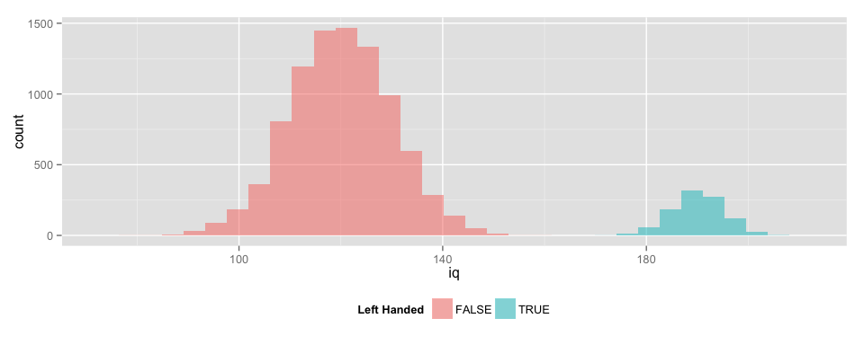
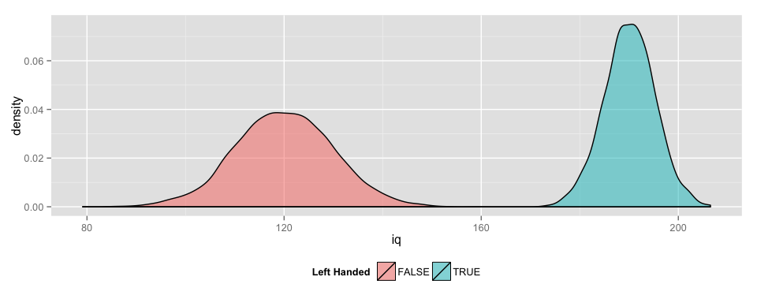
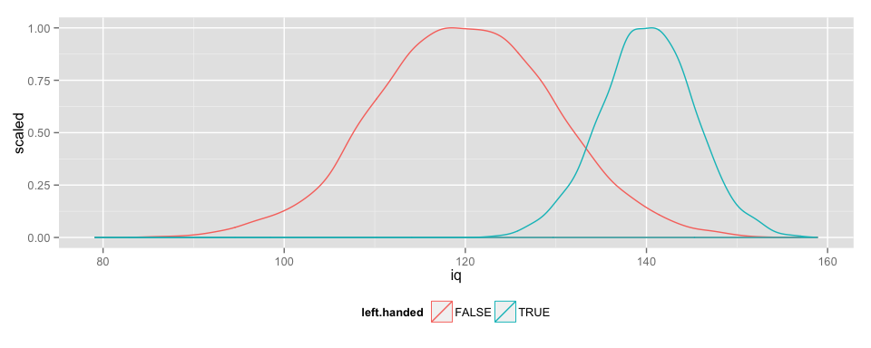
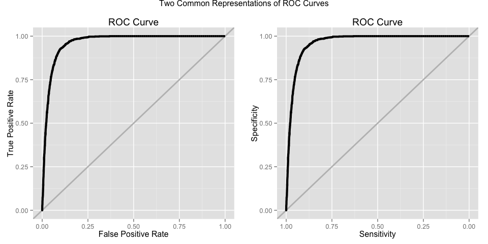

# Vignette: ROC Curves
  
  

<script type="text/javascript" src="js/jquery.min.js"></script>
<script type="text/javascript" src="js/jquery-ui.min.js"></script>
<script type="text/javascript" src="js/jquery.fancybox-1.3.4.pack.min.js"></script>
<script type="text/javascript" src="js/jquery.tocify.js"></script>
<script type="text/javascript" src="js/jquery.scianimator.min.js"></script>
<script type="text/javascript" src="js/page.js"></script>
<script>  </script>
<link type="text/css" rel="stylesheet" href="css/jquery.tocify.css" />
<link type="text/css" rel="stylesheet" media="screen" href="css/jquery.fancybox-1.3.4.css" />
<link type="text/css" rel="stylesheet" href="css/style.css" />
<link type="text/css" rel="stylesheet" href="css/scianimator.blue.css" />
<head> <div id="tableofcontents"></div> </head>
<div id="source" class="tocify"> 
<ul class="tocify-header nav nav-list">
<li class="tocify-item active" style="cursor: pointer;">
<a onclick='toggle_R();' >Show / Hide Source</a>
</li></ul>
</div>

__Kevin M. Smith // Big Data Analytics // Fall 2014__
<hr>

```r
library(knitr)
library(ggplot2)
library(pander)
require(pROC)
require(plyr)
require(data.table)
require(gridExtra)

opts_knit$set(fig.width = 10,
              xtable.type = 'html',
              warning = FALSE,
              cache = TRUE,
              dev = 'png',
              animation.fun = hook_scianimator_controls)

options(xtable.comment = FALSE)
panderOptions('table.split.table', Inf)

# color blind pallete from http://www.cookbook-r.com/Graphs/Colors_(ggplot2)/`
cbPalette <- 
  c("#E69F00", "#56B4E9", "#009E73", "#F0E442", "#0072B2", "#D55E00", "#CC79A7")
```

# Overview
The purpose of this short note is to explore the effects of the classification threshold on true positive and false positive rates when working with Receiver Operating Characteristic (ROC) Curves. ROC Curves are used in classification problems to show the tradeoff between the True Positive Rate and the False Positive Rate.

# In the Laboratory
In this vignette we will work with randomly generated data. In this ficticious example, we will denote two populations: right-handed and left-handed people, with normally distributed IQ scores with differing population means and standard deviations. 

## Example - Ideal Classification
To demonstrate classification under an ideal scenario, we will set up our two populations so that there is only a very small chance of an incorrect classification. 

<div text-align:"center">
$IQ_{Left-Handed} \sim N(190, 5)$ <br>
$IQ_{Right-Handed} \sim N(120, 10)$
</div>


```r
set.seed(100)

# Number | Mean | Standard Deviation
lN = 1000;  lM = 190; lS = 5          # Left-Handed
rN = 9000;  rM = 120; rS = 10         # Right-Handed

data <- data.frame(
  
  left.handed = c(rep(TRUE, lN), 
                  rep(FALSE, rN)),
  
  iq = c(rnorm(lN, lM, lS), 
         rnorm(rN, rM, rS))
  
  )

head(data); tail(data);
```

```
##   left.handed       iq
## 1        TRUE 187.4890
## 2        TRUE 190.6577
## 3        TRUE 189.6054
## 4        TRUE 194.4339
## 5        TRUE 190.5849
## 6        TRUE 191.5932
```

```
##       left.handed       iq
## 9995        FALSE 120.5281
## 9996        FALSE 108.1157
## 9997        FALSE 123.6964
## 9998        FALSE 113.9186
## 9999        FALSE 132.1074
## 10000       FALSE 138.4564
```

### Histograms & Density Plots
The histograms for the populations are shown below. There is a clear line that could be drawn to separate the two populations with little or no judgement required. 


```r
g <- ggplot(data = data)
g <- g + geom_histogram(
  aes(x = iq, fill = left.handed), alpha = 0.5)
g <- g + scale_fill_discrete(name = "Left Handed")
g <- g + theme(legend.position = "bottom") 
#g <- g + scale_fill_manual(values=cbPalette)
g
```

```
## stat_bin: binwidth defaulted to range/30. Use 'binwidth = x' to adjust this.
```

 

By using a kernel density smooth we can eliminate the staggered effect caused by the binning. We will work with kernel density smooths like the one shown below throughout the vignette. 

```r
g <- ggplot(data = data)
g <- g + geom_density(
  aes(x = iq, fill = left.handed), alpha = 0.5)
g <- g + scale_fill_discrete(name = "Left Handed")
g <- g + theme(legend.position = "bottom") 
#g <- g + scale_fill_manual(values=cbPalette)
g
```

 

## Judgemental Classification
Conditions are rarely so ideal. What happens if our population means for IQ are a bit closer?

<div text-align:"center">
$IQ_{Left-Handed} \sim N(140, 5)$ <br>
$IQ_{Right-Handed} \sim N(120, 10)$
</div>


```r
set.seed(100)

# Number | Mean | Standard Deviation
lN = 1000;  lM = 140; lS = 5          # Left-Handed
rN = 9000;  rM = 120; rS = 10         # Right-Handed

data <- data.frame(
  
  left.handed = c(rep(TRUE, lN), 
                  rep(FALSE, rN)),
  
  iq = c(rnorm(lN, lM, lS), 
         rnorm(rN, rM, rS))
  
  )

head(data); tail(data);
```

```
##   left.handed       iq
## 1        TRUE 137.4890
## 2        TRUE 140.6577
## 3        TRUE 139.6054
## 4        TRUE 144.4339
## 5        TRUE 140.5849
## 6        TRUE 141.5932
```

```
##       left.handed       iq
## 9995        FALSE 120.5281
## 9996        FALSE 108.1157
## 9997        FALSE 123.6964
## 9998        FALSE 113.9186
## 9999        FALSE 132.1074
## 10000       FALSE 138.4564
```


There is no longer a line that would cleaning separate the two populations. The threshold will now require some judgement, since the placement of the line will determine the __True Positive, False Positive, True Negative, and False Negative Rates__.


```r
g <- ggplot(data = data)
g <- g + geom_density(
  aes(x = iq, y = ..scaled.., color = left.handed), alpha = 0.5)
#g <- g + scale_fill_continuous(name = "Actually Left Handed?")
#g <- g + scale_color_discrete(name = "Classification Result for Left-Handedness")

g <- g + theme(legend.position = "bottom")
#g <- g + scale_color_manual(name = "Actually Left Handed?", values=cbPalette) 
g
```

 


```r
classify <- function(value, breakpoint){
  return(value > breakpoint)
}

score <- function(classification, truth){  
  type <- as.vector(rep("", length(truth)))
  type[classification & truth] <- "True Positive"
  type[classification & !truth] <- "False Positive"
  type[!classification & !truth] <- "True Negative"
  type[!classification & truth] <- "False Negative"
  return(type)
}

is.correct <- function(results){
  correct <- as.vector(rep(FALSE, length(results)))
  correct[grep("True", results)] <- TRUE
  return(correct)
}

breakpoint = 131.75
```

### The ROC Curve

The ROC curve shows the trade-off frontier for the True Positive and False Positive Rates produced by all possible threshold values. The vertical axis shows the True Positive Rate, which is also known as the __Sensitivity__. The horizontal axis shows the False Positive Rate, which is related to the __Specificity__, by $FPR = 1 - Specificity$.


```r
roc.data <- roc(left.handed ~ iq, data, plot = FALSE)
roc.data <- data.frame(sensitivity = roc.data$sensitivities,
                       specificity = 1 - roc.data$specificities)

roc.base <- ggplot(roc.data, aes(x = specificity, y = sensitivity)) + 
  geom_abline(color = "grey", lwd = 1) + geom_line(lwd = 1.5) + 
  xlab("False Positive Rate") + ylab("True Positive Rate") + ggtitle("ROC Curve")

roc.base2 <- ggplot(roc.data, aes(x = 1 - specificity, y = sensitivity)) + 
  geom_abline(color = "grey", lwd = 1, intercept = 1) + geom_line(lwd = 1.5) + 
  xlab("Sensitivity") + ylab("Specificity") + ggtitle("ROC Curve") +
  scale_x_reverse()

grid.arrange(roc.base, roc.base2, ncol = 2, main = "Two Common Representations of ROC Curves")
```

 

### How the ROC Curve is Formed
This animation shows how the ROC curve is formed as the threshold is moved over the range of possible threshold values. Each threshold value corresponds to a different set of classification errors. Use the controls just below the figure to see how the ROC curve is built bit-by-bit. 


```r
for(breakpoint in c(seq(130, 145, 0.5), 
                    seq(145, 130, -0.5))){
 
data.classified <- mutate(data, 
                prediction = classify(iq, breakpoint), 
                results = score(prediction, left.handed),
                correct = is.correct(results))

plot.info <- ggplot_build(g)$data[[1]]

g1 <- ggplot() + geom_ribbon(data = subset(plot.info, x > breakpoint & group == 2),
                aes(x = x, ymin = ymin, ymax = ymax, fill = "True Positive")) + 
  
  geom_ribbon(data = subset(plot.info, x < breakpoint & group == 1),
                aes(x = x, ymin = ymin, ymax = ymax, fill = "True Negative")) + 
  
  geom_ribbon(data = subset(plot.info, x > breakpoint & group == 1),
                aes(x = x, ymin = ymin, ymax = ymax, fill = "False Positive")) +
  
  geom_ribbon(data = subset(plot.info, x < breakpoint & group == 2),
                aes(x = x, ymin = ymin, ymax = ymax, fill = "False Negative")) +
  
  scale_fill_discrete(name = "Classification Result for Left-Handedness")

g1 <- g1 + geom_vline(x = breakpoint, size = 2, color = "black") + 
  theme(legend.position = "bottom")

g2 <- ggplot(data.classified, aes(x = left.handed, fill = results)) + geom_bar(position = "fill")
g2 <- g2 + theme(legend.position = "none") 
g2 <- g2 + xlab("Left Handed?") + ylab("Classification Success / Error Rates")

contingency <- with(data.classified, 
                    table(prediction, left.handed))

contingency[1,1] <- contingency[1,1] / rN
contingency[1,2] <- contingency[1,2] / lN
contingency[2,1] <- contingency[2,1] / rN
contingency[2,2] <- contingency[2,2] / lN

colnames(contingency) <- c("Right Handed", "Left Handed")
rownames(contingency) <- c("Classified Right", "Classified Left")

g3 <- tableGrob(formatC(contingency, format = "f", digits = 2),
            row.just = "right",
            gpar.rowtext = gpar(col = "black", cex = 1, fontface = "bold"))

g4 <- roc.base + annotate("point", x = contingency[2,1], y = contingency[2,2], color = "red", size = 8)

#grid.arrange(g1, g2, g3, roc.base, nrow = 2, widths = c(3.5, 1, 2, 2.5), 

grid.arrange(arrangeGrob(g1, g2, ncol = 2, widths = c(3.5, 1)),
             arrangeGrob(g3, g4, ncol = 2, widths = c(2, 2.5)),
             nrow = 2, main = paste("Classification, Threshold =", formatC(breakpoint, format = "f", digits = 1)))

}
```


<div class="scianimator">
<div id="unnamed_chunk_9" style="display: inline-block;">
</div>
</div>
<script type="text/javascript">
  (function($) {
    $(document).ready(function() {
      var imgs = Array(62);
      for (i=0; ; i++) {
        if (i == imgs.length) break;
        imgs[i] = "index_files/figure-html/unnamed-chunk-9-" + (i + 1) + ".png";
      }
      $("#unnamed_chunk_9").scianimator({
          "images": imgs,
          "delay": 50,
          "controls": ["previous", "play", "next"],
      });
      $("#unnamed_chunk_9").scianimator("play");
    });
  })(jQuery);
</script>


# Appendix

## Reproducibility Information

```r
sessionInfo()
```

R version 3.1.2 (2014-10-31)
Platform: x86_64-apple-darwin13.4.0 (64-bit)

locale:
[1] en_US.UTF-8/en_US.UTF-8/en_US.UTF-8/C/en_US.UTF-8/en_US.UTF-8

attached base packages:
[1] grid      stats     graphics  grDevices utils     datasets  methods  
[8] base     

other attached packages:
[1] gridExtra_0.9.1  data.table_1.9.4 plyr_1.8.1       pROC_1.7.3      
[5] pander_0.5.1     ggplot2_1.0.0    knitr_1.7.10    

loaded via a namespace (and not attached):
 [1] chron_2.3-45     codetools_0.2-9  colorspace_1.2-4 digest_0.6.4    
 [5] evaluate_0.5.5   formatR_1.0      gtable_0.1.2     htmltools_0.2.6 
 [9] labeling_0.3     MASS_7.3-35      munsell_0.4.2    proto_0.3-10    
[13] Rcpp_0.11.3      reshape2_1.4.1   rmarkdown_0.3.10 scales_0.2.4    
[17] stringr_0.6.2    tools_3.1.2      yaml_2.1.13     
