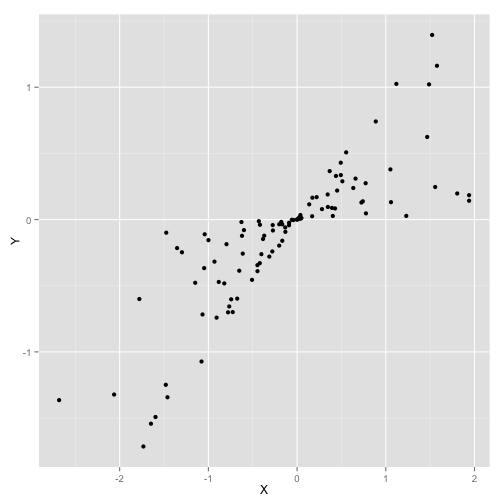
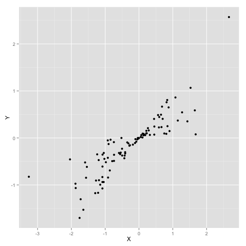
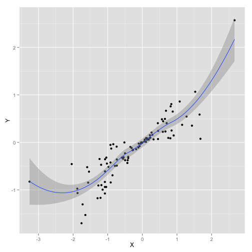
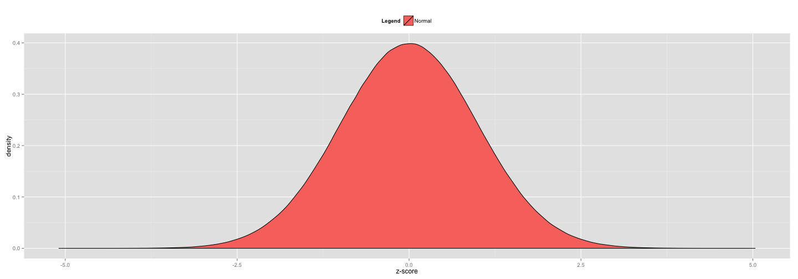

<script type="text/javascript" src="../TimeSeriesAnalysis/js/jquery.min.js"></script>
<script type="text/javascript" src="../TimeSeriesAnalysis/js/jquery-ui.min.js"></script>
<script type="text/javascript" src="../TimeSeriesAnalysis/js/jquery.fancybox-1.3.4.pack.min.js"></script>
<script>
$(function($) {
 	var addToAll = true;
 	var gallery = false;
 	var titlePosition = 'inside';
 	$(addToAll ? 'img' : 'img.fancybox').each(function() {
 		var $this = $(this);
 		var title = $this.attr('title');
 		var src = $this.attr('data-big') || $this.attr('src');
 		var a = $('<a href="#" class="fancybox"></a>').attr('href', src).attr('title', title);
 		$this.wrap(a);
 	});
 	if (gallery)
 		$('a.fancybox').attr('rel', 'fancyboxgallery');
 	$('a.fancybox').fancybox({
 		titlePosition: titlePosition
 	});
 });
</script>
<link type="text/css" rel="stylesheet" media="screen" href="../TimeSeriesAnalysis/jquery.fancybox-1.3.4.css" />

A Brief Overview
========================================================
<div style="font-size: 2em; line-height: 100%;"> 
Dynamic Documents, <br /> Literate Programming, and Reproducible Research with R
</div>
<br><br>
<div style="font-size: 1em;">
 Kevin M. Smith <br>
 November 25th, 2014
</div>

Definitions
========================================================

- Dynamic Documents
  - Input and output are linked
  - a change in the input propogates through the document
- Literate Programming
  - The Practice of Mixing Natural Languages with Programming Langauges
- Reproducible Research (for computational experiments)
  - An emerging set of best practices, including __open and complete documentation of data sets and code__, documenting computational environments, random number generator seeds, etc.

What is R?
========================================================
<iframe src="http://en.m.wikipedia.org/wiki/R_(programming_language)" height="1200px" width="100%"></iframe>

Literate Programming Example
========================================================
$$ X \sim N(0, 1)$$
$$ B \sim U(0, 1) $$
$$ Y \equiv B \cdot X $$


```r
X = rnorm(100)
B = runif(100)
Y = X * B
cor(X, Y)
```

```
[1] 0.8440621
```
<br>
### __Query:__
Is the relationship $Y = f(X)$ linear? 

Build the Plot
========================================================
Import

```r
library(ggplot2); 
data = data.frame(X = X, Y = Y)
```

Base Layer

```r
base <- ggplot(data, aes(x = X, y = Y))
```

Scatterplot Layer

```r
g <- base + geom_point()
```

Scatterplot
========================================

```r
g
```



Add LOESS Smooth
========================================

```r
g + geom_smooth()
```



Flip Coordinates
========================================

```r
g + coord_flip()
```



Density Esitmation
========================================

```r
g + stat_density2d()
```


Check Normality of X
================================
Generate large normal sample: $n = 10^{6}$ 

```r
norm <- rnorm(10E6)
```

Build density plot graphics and store in __g__

```r
g <- ggplot(data) + xlab("z-score")
g <- g + theme(legend.position = "top")
g <- g + scale_fill_discrete(name = "Legend") 
```

Empirical Normal Curve
================
Add __normal__ sample of size $10^{6}$...

```r
g <- g + geom_density(
  aes(x = norm, fill = "Normal"))
g
```

 

Combined Empirical Density Curves
================
Add $X$...

```r
g <- g + geom_density(
  aes(x = X, fill = "X"), 
  alpha = 0.5)
g
```

 

================
<iframe src="http://kevin-m-smith.github.io/BDA2014/TimeSeriesAnalysis/" width="1200px" height="1200px"></iframe>


Questions? Feedback?
================
<br>
<br>
<br>
<br>
<div style="font-size: 3em;"> Thank you! </div>

