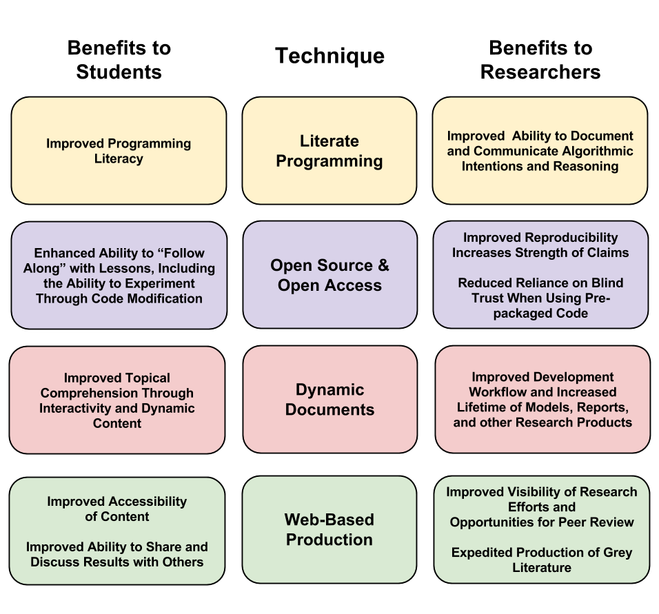

<hr>
## Abstract
In preparation for the era of "Big Data" it is imperative that we reflect on our current abilities to carry out computational research in a reproducible way, otherwise we risk our ambitions outpacing our comprehension. Dynamic Documents and Literate Programming can be combined to promote reproducible research and enhanced course material that promotes both topical (e.g. hydrologic) and programming literacy. Such techniques are likely only to grow in importance as the face of academic publishing changes from formal manuscripts to multimedia interactive grey literature. Finally, a gallery of examples is provided via embedded hyperlinks. 

__N.B.__ If you are having trouble opening the links in the PDF version of this report, the web version of this report is available at the following address: http://kevin-m-smith.github.io/BDA2014/FinalProject/Report

## The Windfalls and Pitfalls of The New Frontier
In many ways, the environmental engineering laboratory of today is markedly different from those of ten and twenty years ago. There are, of course, the familiar relics - like fiberglass flumes, scale models, stir plates and glassware. However, for many of us today, the greater part of our efforts consists solely of pushing around ones and zeros. We've traded the tedium of punch cards for the convenience of laptops; gone are the days of hand drawn plots on semi-log paper. Tables of approximations and significance values are all but forgotten.

On the whole the digital revolution has been a boon to our profession, but it has not been without risk. The ease with which computational experiments may now carried out is a double edged sword. It has become all too easy to expand the boundaries of inquiry beyond the scope of our comprehension. When the day's work is spent coaxing bits this way and that, how can we escape the temptation of the spurious pattern? When two decades have been invested into perfecting a distributed model, how can we admit to ourselves it is impossible to parameterize?

<hr>

## Taming the Wild West
### The Call For Reproducibility in Computational Experiments
While famous scientific discoveries have been the result of the chance encounter with a fallen apple (e.g. [Newton](http://en.wikipedia.org/wiki/Isaac_Newton#Apple_incident)), or have been borne out of serendipity in the chaos of a graduate laboratory (e.g. [Geiger and Marsden](http://en.wikipedia.org/wiki/Geiger–Marsden_experiment)), their significance is derived from their reproducibility. This reproducibility is the hallmark of contemporary scientific epistemology. Computational experiments should be subject to these same expectations.  Indeed, computational inquiry does not suffer from the physical anomalies of traditional experiments that result from non-ideal laboratory conditions, machine calibration, measurement error, and so on. In fact, there is no reason that computational experiments shouldn't be __perfectly reproducible__. 

Unfortunately finding a publication meeting this standard appears to be the exception rather than the rule. See [Ruschhaupt et al. 2004, page 20](#Ruschhaupt) for a discussion of how attempts to reproduce computational research often fail even with help from authors. Indeed, [Green 2003](#Green) offers:

> "Most statistics papers, as published, no longer satisfy the conventional scientific criterion of reproducibility: could a reasonably competent and adequately equipped reader obtain equivalent results if the experiment or analysis were repeated? Typically, the answer is no..."

According to [Rossini et. al 2003](#Rossini) this needn't be the norm:

> "Computations can be proofed. Correctness can be verified by delivering appropriately documented and functional code, along with corresponding inputs and data for all results along with the paper."

In _Reproducible Research: the Bottom Line_ [de Leeuw](#Leeuw) coins _Claerbout's Principle_, after Standford geophysicist Jon Claerbout, who lamented the agony with which members of his lab attempted to reproduce their own results only months later [Schwab et al. 2009](#Schwab). It reads as follows:

> "An article about computational science in a scientific publication is _not_ the scholarship itself, it is merely _advertising_ of the scholarship. The actual scholarship is the complete software development environment and the complete set of instructions which generated the figures." -(de Leeuw)

Therefore, meaningful scholarship in the era of Big Data will require publication of far more than just the final manuscript. To prepare up-and-coming students for this change it is critical to cultivate __programming literacy__. 

<hr>
## Survival Skills
### Consumers and Producers
For today's engineering professional, basic computer literacy is a requisite skill. However, on the whole we are missing the mark on programming literacy. Where we might define computer literacy as the ability to use a computer for regular tasks (browsing the internet, sending email, word processing, etc.), programming literacy is the ability to understand and alter computer routines. The profound power of programming literacy is that it turns computer _users_ into _operators_. Programming literate professionals are not merely _consumers_ of pre-packaged software, but can also be _producers_. In any event, undertaking statistical analysis without programming literacy can be a dangerous endeavor. 

### The Benefits and Pitfalls of Obscurity
Today most researchers use off-the-shelf models and statistical packages that come pre-assembled. In these software packages, algorithms are quietly obfuscated from the user under what is essentially layer of _trust_. This obscurity is beneficial in many ways, as it improves the consistency of analyses and allows critical assessments to proceed at a more rapid pace. 

Of course, there are some trade-offs. By not forcing the user to program each routine by hand, under-the-hood programming errors are greatly reduced. This comes with increased risk of unintentional misuse. Since the reasoning of the algorithm selected is not as clear, it is much harder to tell if we have selected the right tool for the job.

### The Case for Open Source Software
One elegant way to move-the-knee of this trade-off frontier is to use open source software, such as _R_. The _R_ statistical programming environment includes pre-built software packages, but allows the user to view and alter the source code as appropriate. Such modification is not possible with popular commercial packages such as MatLab, Minitab, Macsyma, Mathematica, SPSS, SAS, or S-plus. When these software packages give different results, there is no way to determine the source of the disagreement. See [Fateman's 1993](#Fateman) review of Mathematica.  Furthermore, [de Leeuw](#Leeuw) argues that publishing results that rely on these proprietary packages violates the ideals of scientific reproducibility. 

### Programming Literacy Through Literate Programming
With the source of the software exposed, it is much easier to promote programming literacy. Specifically, one of the most successful approaches is "literate programming", originally coined in [Knuth 1992](#Knuth), and developed subsequently by others (e.g. [Ramsey 1994](#Ramsey)). Literate programming allows natural languages and programming languages to be interleaved in a way that the code runs in place, and the results may appear among the natural language. It also allows the user to "follow along at home" by using and modifying the code. 

#### Simple Literate Programming Example with _R_ 
Given:

<div style="text-align: center">
 * $X \sim N(0,1)$ 
 * $B \sim U(0,1)$ 
 * $Y \equiv B \cdot X$ 
</div>

Can you determine if the relationship $Y = f(X)$ is linear?
```{r}
X = rnorm(100)
B = runif(100)
Y = X * B
```

First, we might ask, what is the Pearson sample correlation coefficient, $\rho$?
```{r, results='asis'}
cor(X, Y)
```

<br> However, as we know from past examples of $\rho$, this doesn't tell us much about the linearity of $Y = f(X)$. Let's look at a plot instead.
```{r, fig.width = 6, fig.height = 3}
plot(X, Y)
```

<hr>
## The New Storytelling
### Dynamic Documents
Dynamic Documents are a means of packaging the data, analysis, code, outputs, and computational environment together in such a way that the the entire unmodified document can be re-run, and the same results obtained. Dynamic Documents eliminate the need for __copy and paste__ to produce publishable materials, minimizing transposition errors. They also greatly improve the lifespan of research products, since they can be reproduced easily at a later date. Furthermore since the justification for the methods used is provided inline with the code, it encourages peer-review, which is generally a daunting task for computational experiments. See [Sawitzki 1999](#Sawitzki) and [Gentleman and Lang 2007](#Gentleman).

### The Web & Grey Literature
The Internet and the World Wide Web have dramatically changed the modes available to those seeking an audience or peer review for their work. [Banks 2006](#Banks) predicts the eventual 'collapse' of any distinction between formal literature, and so-called 'grey' literature which is published through non-traditional channels, such as blogs. Traditionally only formal peer reviewed publications have been taken to be sound references. However, in light of _Claerbout's Principle_, which suggests that manuscripts are merely an _advertisement_ of scholarship, not the scholarship _in the flesh_, web-based grey literature may be of more value. This is because the space and formatting limitations of traditional documents do not exist on the web. See [Stodden 2010](#Stodden).

<hr>
## Conclusion: Bringing It All Together
Literate Programming and Dynamic Documents have long been a dream, but in the last decade, they have become fully realizable [Härdle and  Rönz, 2002](#Hardle). Particularly promising are efforts surrounding _R_, and open source statistical language and programming environment originally developed and introduced by [Ihaka and Gentleman 1996](#Ihaka). In the past few years, the introduction of _Pandoc_ by [MacFarlane 2012](#MacFarlane) and _knitr_ by [Xie 2013](#Xie) have made Literate Programming and the generation of Dynamic Documents even easier.

Blending the two can put a new spin on Socratic question-and-answer teaching styles. See [_What did You Mean?_](http://kevin-m-smith.github.io/BDA2014/Means/WhatDidYouMean/). Course notes no longer need to be a photocopy of a photocopy of a photocopy. Pages can come alive in full color with interactive examples that both show and tell simultaneously. See [ROC Curves](http://kevin-m-smith.github.io/BDA2014/Classification/ROC/). This method is effective both for teaching programming skills (see [Leaps and Bounds](http://kevin-m-smith.github.io/BDA2014/Regression/LeapsAndBounds/)) and topical material (see [Branch and Bound](http://kevin-m-smith.github.io/BDA2014/Regression/BranchAndBound/)). Products can be packaged long-form (see [ARIMA Models](http://kevin-m-smith.github.io/BDA2014/TimeSeriesAnalysis/)), or in slide-show format (see [Occam's Razor](http://kevin-m-smith.github.io/BDA2014/Bayesian/OccamsRazor/)).

By implementing the best practices for computational reproducbility advocated for by [Wilson et al. 2014](#Wilson) and [Gentleman 2005](#Gentleman2) the benefits of Dynamic Documents and Literate Programming are extended to students and researchers alike, fulfilling [de Leeuw's (2001)](#Leeuw) vision:

> "there is no reason to limit the Claerbout’s Principle to published articles. We can make exactly the same statement about our lectures and teaching, certainly in the context of graduate teaching. We must be able to give our students our code and our graphics files, so that they can display and study them on their own computers (and not only on our workstations, or in crowded university labs)."




## Gallery
The following is a selection of examples of Dynamic Documents and Literate Programming. Each is an expression of a unique style as I work to study the pro's and con's of each layout. As such comments and feedback about usability are very welcome. 

### Vignettes
 * Regression
     * [Parameterization - The RSS Ratchet](http://kevin-m-smith.github.io/BDA2014/Regression/TheRatchet/)
     * [Multiple Objectives](http://kevin-m-smith.github.io/BDA2014/Regression/MultipleObjectives/)
     * [Best Subsets - Branch and Bound](http://kevin-m-smith.github.io/BDA2014/Regression/BranchAndBound/)
     * [Best Subsets - Leaps and Bounds](http://kevin-m-smith.github.io/BDA2014/Regression/LeapsAndBounds/)
     * [Tukey's Bulging Rule](http://kevin-m-smith.github.io/BDA2014/Regression/BulgingDiagram/)
 * Classification
     * [ROC Curves](http://kevin-m-smith.github.io/BDA2014/Classification/ROC/)
 * Means
     * [What did you mean?](http://kevin-m-smith.github.io/BDA2014/Means/WhatDidYouMean/)


### Tutorials
 * Bayesian
     * [Occam's Razor in Model Selection](http://kevin-m-smith.github.io/BDA2014/Bayesian/OccamsRazor/)
 * Time Series Analysis
     * [ARIMA Models](http://kevin-m-smith.github.io/BDA2014/TimeSeriesAnalysis/)


## References

 * <a name="Rossini"></a> A. J. Rossini, T. Lumley, and F. Leisch, “On the Edge: Statistics & Computing: Reproducible Statistical Research,” Chance, vol. 16, no. 2, pp. 41–45, 2003.
 
 * <a name="Ruschhaupt"></a> M. Ruschhaupt, W. Huber, A. Poustka, and U. Mansmann, “A compendium to ensure computational reproducibility in high-dimensional classification tasks,” Statistical Applications in Genetics and Molecular Biology, vol. 3, no. 1, 2004.
 
 * <a name="Green"></a> P. J. Green, “Diversities of gifts, but the same spirit,” Journal of the Royal Statistical Society: Series D (The Statistician), vol. 52, no. 4, pp. 423–438, 2003.
 
 * <a name="Leeuw"></a> J. De Leeuw, “Reproducible research. the bottom line,” Department of Statistics, UCLA, 2001.

 * <a name="Schwab"></a>M. Schwab, M. Karrenbach, and J. Claerbout, “Making scientific computations reproducible,” Computing in Science & Engineering, vol. 2, no. 6, pp. 61–67, 2000.
 
 * <a name="Fateman"></a>R. J. Fateman, “A Review of Mathematica,” J. Symbolic Comp, vol. 13, pp. 545–579, 1993.

 * <a name="Knuth"></a> D. E. Knuth, “Literate programming,” CSLI Lecture Notes, Stanford, CA: Center for the Study of Language and Information (CSLI), 1992, vol. 1, 1992.
 
 * <a name="Ramsey"></a> N. Ramsey, “Literate programming simplified,” Software, IEEE, vol. 11, no. 5, pp. 97–105, Sep. 1994.

 * <a name="Sawitzki"></a> G. Sawitzki, “Keeping statistics alive in documents,” Discussion Papers, Interdisciplinary Research Project 373: Quantification and Simulation of Economic Processes, 1999.

 * <a name="Gentleman"></a> R. Gentleman and D. Temple Lang, “Statistical Analyses and Reproducible Research,” Journal of Computational and Graphical Statistics, vol. 16, no. 1, pp. 1–23, Mar. 2007.

 * <a name="Stodden"></a> V. C. Stodden, “The scientific method in practice: Reproducibility in the computational sciences,” 2010.
 
 * <a name="Banks"></a> M. A. Banks, “Towards a continuum of scholarship: The eventual collapse of the distinction between grey and non-grey literature,” Publishing Research Quarterly, vol. 22, no. 1, pp. 4–11, 2006.

 * <a name="MacFarlane"></a> J. MacFarlane, Pandoc: a universal document converter. 2012.

 * <a name="Härdle"></a> W. Härdle and B. Rönz, Compstat Proceedings in Computational Statistics. Heidelberg: Physica-Verlag HD: Imprint: Physica, 2002.
 
* <a name="Ihaka"></a>  R. Ihaka and R. Gentleman, “R: A Language for Data Analysis and Graphics,” Journal of Computational and Graphical Statistics, vol. 5, no. 3, pp. 299–314, Sep. 1996.

 * <a name="Xie"></a> Y. Xie, “knitr: A general-purpose package for dynamic report generation in R,” R package version, vol. 1, no. 7, 2013.
 
 * <a name="Wilson"></a> G. Wilson, D. A. Aruliah, C. T. Brown, N. P. Chue Hong, M. Davis, R. T. Guy, S. H. D. Haddock, K. D. Huff, I. M. Mitchell, M. D. Plumbley, B. Waugh, E. P. White, and P. Wilson, “Best Practices for Scientific Computing,” PLoS Biology, vol. 12, no. 1, p. e1001745, Jan. 2014.

 * <a name="Gentleman2"></a> R. Gentleman, “Reproducible Research: A Bioinformatics Case Study,” Statistical Applications in Genetics and Molecular Biology, vol. 4, no. 1, Jan. 2005.


