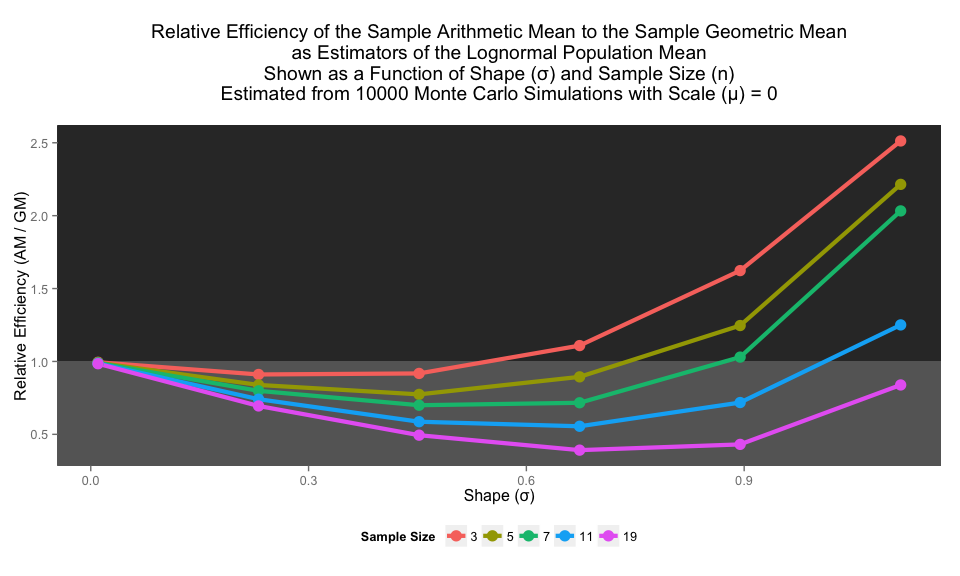
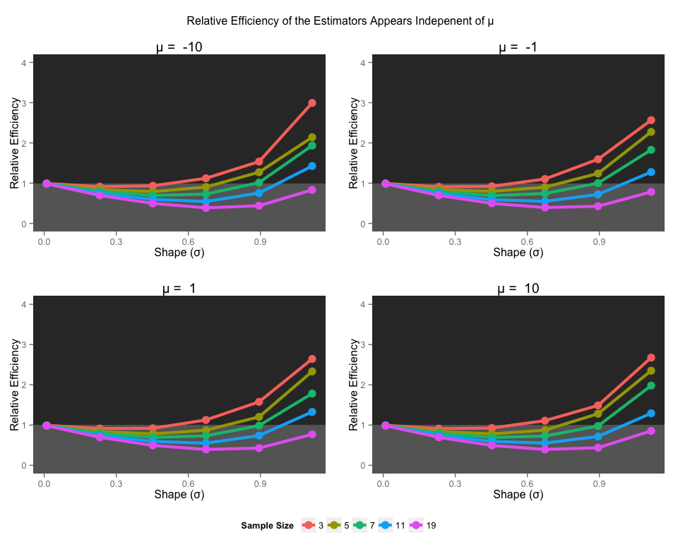
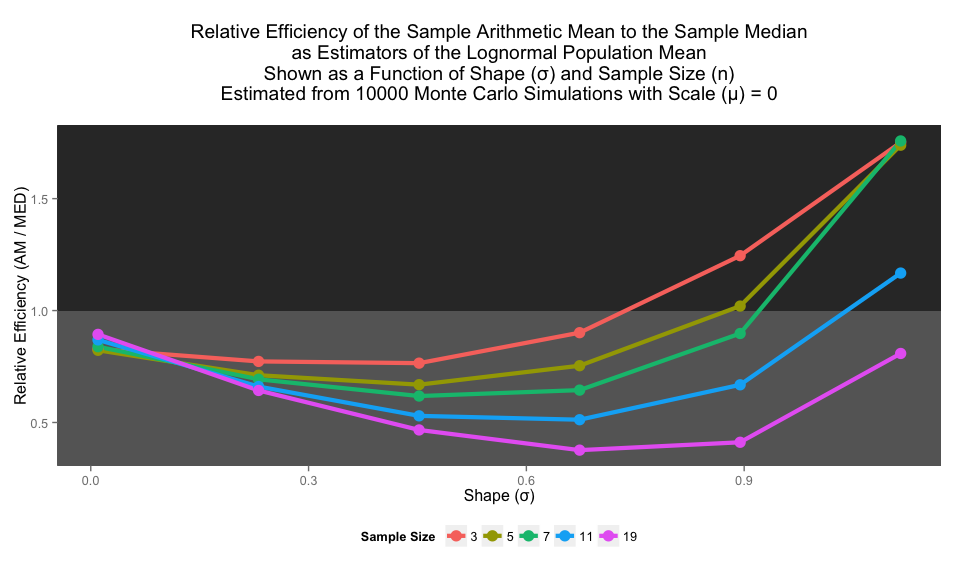

# On the Geometric Mean
  
  
<script type="text/javascript" src="js/jquery.min.js"></script>
<script type="text/javascript" src="js/jquery-ui.min.js"></script>
<script type="text/javascript" src="js/jquery.fancybox-1.3.4.pack.min.js"></script>
<script type="text/javascript" src="js/jquery.tocify.js"></script>
<script type="text/javascript" src="js/jquery.scianimator.min.js"></script>
<script type="text/javascript" src="js/page.js"></script>
<script>  </script>
<link type="text/css" rel="stylesheet" href="css/jquery.tocify.css" />
<link type="text/css" rel="stylesheet" media="screen" href="css/jquery.fancybox-1.3.4.css" />
<link type="text/css" rel="stylesheet" href="css/style.css"
<head> <div id="tableofcontents"></div> </head>
<div id="source" class="tocify"> 
<ul class="tocify-header nav nav-list">
<li class="tocify-item active" style="cursor: pointer;">
<a onclick='toggle_R();' >Show / Hide Source</a>
</li></ul>
</div>
__CEE 202 | Project 1 | Kevin Smith__


# Overview


## Getting Started
#### Required Libraries

```r
require(plyr)
require(ggplot2)
require(gridExtra)
require(reshape2)
require(doMC)
```

#### Setup Parallel Processing

```r
registerDoMC(cores = 4)
```

# Estimator Efficiency

### Monte Carlo Setup

#### Geometric Mean

```r
gm <- function(x) exp(mean(log(x)))
```

#### Experiment Description

```r
experiment <- function(n, mu, sigma){
  sample <- rlnorm(n, mu, sigma)
  m <- mean(sample)
  g <- gm(sample)
  d <- median(sample)
  result <- data.frame(m = m, g = g, d = d)
}
```

#### Mean Squared Error Calculation

```r
mse <- function(x, X){
  x <- unlist(x)
  se <- (x - X)^2
  return(mean(se))
}
```

## Setting up the Monte Carlo Simulator

```r
monte.carlo <- function(n.samples, mu, sigma){
  M <- exp(mu + sigma/2)
  experimental.results <- replicate(
    n.experiments, 
    experiment(n.samples, mu, sigma), 
    simplify = "data.frame")
  
  mean.squared.error <- (adply(experimental.results, 1, mse, M))
  t(data.frame(mean.squared.error, row.names = 1))
}
```

## Setting Up the Experimental Classes

```r
n.experiments = 10000;

n.samples <- c(3, 5, 7, 11, 19)
mu <- c(-10, -1, 0, 1, 10)
sigma <- seq(0.01, 2, length.out = 10) 

experimental.classes <- expand.grid(
  mu = mu, 
  sigma = sigma, 
  n.samples = n.samples)
```

## Running the Simulations

```r
set.seed(202)

rmse.values <- adply(experimental.classes, 1, mutate,
                mse = monte.carlo(n.samples, mu, sigma),
                eff = mse[,1] / mse, .parallel = TRUE)
```


## Reproducing Figure 6.6

### Defining A Plotting Function

```r
g.plotter <- function(this.mu){
  sub <- subset(rmse.values, mu == this.mu & sigma < 1.2)
  p <- ggplot(sub, aes(x = sigma, y = eff[,2])) 
  p <- p + geom_rect( xmin = -10, xmax = 10, ymin = 1, ymax = 10, fill = "grey20")
  p <- p + geom_rect( xmin = -10, xmax = 10, ymin = -10, ymax = 1, fill = "grey40")
  p <- p + geom_line(aes(color = as.factor(n.samples)), size = 1.5)
  p <- p + geom_point(aes(color = as.factor(n.samples)), size = 4)
  p <- p + theme(legend.position = "bottom")
  p <- p + labs(title = (paste("Relative Efficiency of the Sample Arithmetic Mean to the Sample Geometric Mean\n as Estimators of the Lognormal Population Mean \n Shown as a Function of Shape (σ) and Sample Size (n) \n Estimated from", n.experiments, "Monte Carlo Simulations with Scale (μ) =", this.mu, "\n")))
  p <- p + xlab("Shape (σ)") + ylab("Relative Efficiency (AM / GM)")
  p <- p + scale_colour_discrete(name = "Sample Size")
  p
}
```


```r
g.plotter(0)
```

 


```r
legend <- ggplot_gtable(ggplot_build(g.plotter(0)))
index <- which(sapply(legend$grobs, function(x) x$name) == "guide-box")
legend <- legend$grobs[[index]]

g.plotter2 <- function(this.mu){ 
  g.plotter(this.mu) + ggtitle(paste("μ = ", this.mu)) +
    theme(legend.position = "none") + ylab("Relative Efficiency") + ylim(0,4)
}

p <- arrangeGrob(arrangeGrob(
  g.plotter2(-10), g.plotter2(-1), g.plotter2(1), g.plotter2(10), 
  nrow = 2, ncol = 2, 
  main = "\n Relative Efficiency of the Estimators Appears Indepenent of μ"), 
  legend,
  nrow = 2, heights = c(7.5,0.5))

p
```

 


```r
d.plotter <- function(this.mu){
  sub <- subset(rmse.values, mu == this.mu & sigma < 1.2)
  p <- ggplot(sub, aes(x = sigma, y = eff[,3])) 
  p <- p + geom_rect( xmin = -10, xmax = 10, ymin = 1, ymax = 10, fill = "grey20")
  p <- p + geom_rect( xmin = -10, xmax = 10, ymin = -10, ymax = 1, fill = "grey40")
  p <- p + geom_line(aes(color = as.factor(n.samples)), size = 1.5)
  p <- p + geom_point(aes(color = as.factor(n.samples)), size = 4)
  p <- p + theme(legend.position = "bottom")
  p <- p + labs(title = (paste("Relative Efficiency of the Sample Arithmetic Mean to the Sample Median\n as Estimators of the Lognormal Population Mean \n Shown as a Function of Shape (σ) and Sample Size (n) \n Estimated from", n.experiments, "Monte Carlo Simulations with Scale (μ) =", this.mu, "\n")))
  p <- p + xlab("Shape (σ)") + ylab("Relative Efficiency (AM / MED)")
  p <- p + scale_colour_discrete(name = "Sample Size")
  p
}

d.plotter2 <- function(this.mu){ 
  d.plotter(this.mu) + ggtitle(paste("μ = ", this.mu)) +
    theme(legend.position = "none") + ylab("Relative Efficiency") + ylim(0,4)
}
```


```r
d.plotter(0)
```

 


```r
p <- arrangeGrob(arrangeGrob(
  g.plotter2(-10), g.plotter2(-1), g.plotter2(1), g.plotter2(10), 
  nrow = 2, ncol = 2, 
  main = "\n Relative Efficiency of the Estimators Appears Indepenent of μ"), 
  legend,
  nrow = 2, heights = c(7.5,0.5))

p
```

 


# Regulatory Games


```r
TMDL = 33
mu = log(60)
sigma = 0.4
n.samples = 1:32
n.experiments = 10000

experimental.classes <- expand.grid(
  mu = mu, 
  sigma = sigma, 
  n.samples = n.samples)

experiment <- function(n, mu, sigma){
  gm(rlnorm(n, mu, sigma))
}

monte.carlo <- function(n.samples, mu, sigma){
  experimental.results <- replicate(
    n.experiments, 
    experiment(n.samples, mu, sigma))
  
  return(mean(experimental.results))
}

set.seed(202)

mean.gm.values <- adply(experimental.classes, 1, mutate,
                mean.gm = monte.carlo(n.samples, mu, sigma),
                .parallel = TRUE)

g <- ggplot(mean.gm.values, aes(x = n.samples, y = mean.gm)) + geom_point()
g <- g + geom_smooth(level = 0)
g <- g + ggtitle("Expected Value of the Sample Geometric Mean is versus Sample Size, with LOESS")
g <- g + xlab("Sample Size") + ylab("E[g]")
```


```r
g1 <- replicate(n.experiments, rlnorm(1, log(60),  0.4))
g4 <- replicate(n.experiments, gm(rlnorm(4, log(60), 0.4)))
g32 <- replicate(n.experiments, gm(rlnorm(32, log(60), 0.4)))

sampling.data <- data.frame(g1 = g1, g4 = g4, g32 = g32)

lines <- data.frame(type = "means",
                   values = c(mean(g1),
                              mean(g4), 
                              mean(g32)))

base <- ggplot(sampling.data) + theme_bw()
base <- base + xlim(0, 150) + ylim(0, 0.1)
base <- base + geom_vline(x = TMDL, size = 2)


p1 <- base + geom_density(aes(x = g1), 
                       alpha = 0.2, fill = "#F8766D") 
#p1 <- p1 + geom_vline(x = mean(g1), size = 2, 
                      color = "#F8766D")
p1

p2 <- p1 + geom_density(aes(x = g4), alpha = 0.2, fill = "#A3A500") 
#p2 <- p2 + geom_vline(x = mean(g4), size = 2, color = "#A3A500")
p2

p3 <- p2 + geom_density(aes(x = g32), alpha = 0.2, fill = "#00BF7D") 
#p3 <- p3 + geom_vline(x = mean(g32), size = 2, color = "#00BF7D")
p3


p3 <- p3 + gg("Title")


p <- ggplot(sampling.data, aes(x = g1))
p <- p + geom_density(alpha = 0.2, fill = "#F8766D") 
p <- p + xlim(0, 150) + ylim(0, 0.075)
p <- p + geom_vline(x = TMDL, size = 2)
p <- p + geom_vline(x = mean(g1), size = 2, color = "#F8766D")
p


sampling.data <- melt(sampling.data)

p <- ggplot(sampling.data, aes(x = value, linetype = variable, fill = variable)) + theme_bw()
p <- p + geom_density(alpha = 0.2) + xlim(0, 150)
p <- p + geom_vline(x = 33, size = 1, color = "grey20")
p <- p + xlab("Geometric Mean of Samples")
p <- p + theme(legend.position = "none")
p <- p + geom_text("test", y = 0.075, x = 75)
p
```


