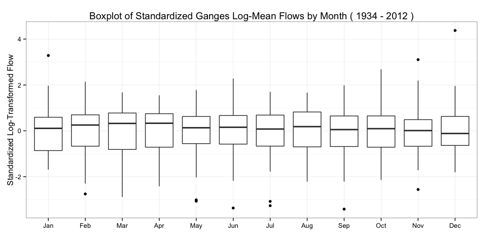
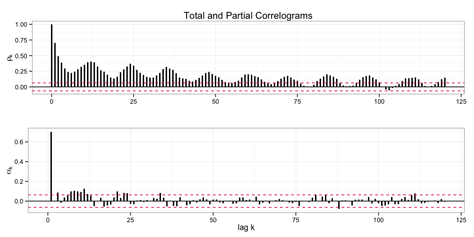
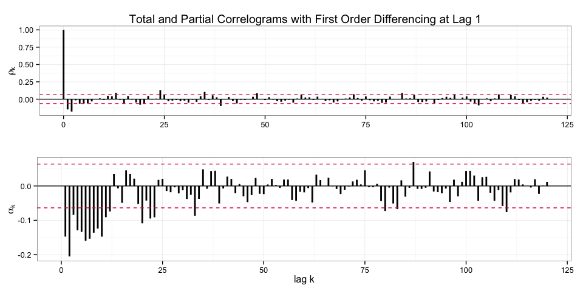

# Time Series Analysis Tutorial
  
  

<script type="text/javascript" src="js/jquery.min.js"></script>
<script type="text/javascript" src="js/jquery-ui.min.js"></script>
<script type="text/javascript" src="js/jquery.fancybox-1.3.4.pack.min.js"></script>
<script type="text/javascript" src="js/jquery.tocify.js"></script>
<script type="text/javascript" src="js/jquery.scianimator.min.js"></script>
<script type="text/javascript" src="js/page.js"></script>
<link type="text/css" rel="stylesheet" href="css/jquery.tocify.css" />
<link type="text/css" rel="stylesheet" media="screen" href="css/jquery.fancybox-1.3.4.css" />
<link type="text/css" rel="stylesheet" href="css/style.css"
<head> <div id="tableofcontents"></div> </head>
<div id="source" class="tocify"> 
<ul class="tocify-header nav nav-list">
<li class="tocify-item active" style="cursor: pointer;">
<a onclick='toggle_R();' >Show / Hide Source</a>
</li></ul>
</div>

__Kevin M. Smith // Big Data Analytics // Fall 2014__
<hr>


# Overview
This tutorial explores basic data manipulation and time series analysis techniques.  The data set is a complete record of the mean monthly flows of the Ganges from January 1934 to December 2013. The source code and data for this tutorial is available [here](http://www.github.com/Kevin-M-Smith/BDA2014/TimeSeriesAnalysis). The most recent web version of this document is available [here](http://kevin-m-smith.github.io/BDA2014/TimeSeriesAnalysis).


<hr>
# Data Cleaning
## Importing the Data

First let's load our data into a __data frame__ object using the __read.csv()__ command. Then we'll followup with a __head()__ command to look at the first few rows of the data set. 

```r
ganges <- read.csv("data/Ganges.csv")
head(ganges)
```

```
##   Year  Jan  Feb  Mar  Apr  May  Jun   Jul   Aug   Sep   Oct  Nov  Dec
## 1 1934 2778 2458 2228 2138 1987 3613 19775 36277 40084 18625 6197 3432
## 2 1935 2389 2056 1625 1888 1654 2918 13086 38239 27645 13908 4531 3356
## 3 1936 2858 2312 2442 1434 1778 5189 22873 39497 38061 16688 6665 3830
## 4 1937 2630 2495 2392 1803 1877 3440 11893 33913 30065 18748 6379 3495
## 5 1938 2550 2176 2013 2216 2053 8557 28319 43681 33735 10132 4880 3254
## 6 1939 2291 2164 2096 1750 1790 3090 13052 28606 26545 12759 5277 3132
```

The data are organized into 13 columns. The first contains the year of the observations in a given row, while the other 12 contain the mean monthly flow in cubic feet per second (CFS). 

## Checking for Missing Values
Let's verify that the data set is complete. With a data set this small it is easy to look for missing data visually, but with larger data sets this is difficult. For a simple check we can use __sapply()__ and __is.na()__. Here we count each occurrence of missing data using __sum()__. The result is a column-wise count of the missing values. If the data set is complete we should see all zeros.

```r
sapply(ganges, function(x) sum(is.na(x)))
```

```
## Year  Jan  Feb  Mar  Apr  May  Jun  Jul  Aug  Sep  Oct  Nov  Dec 
##    0    0    0    0    0    0    0    0    0    0    0    0    0
```

## Reshaping the Data Frame
The shape of the data frame is not currently very conducive to plotting as a time series. It would be easier to plot discharge as a function of time if there were instead one observation of discharge per row. An easy way to make this happen is to "melt" the data frame using the __reshape2__ package. The __melt()__ takes arguments that specify how the data frame should be "melted." The __id.vars__ argument specifies the names of the columns that should be preserved as columnar variables. Here we want to preserve the __Year__ column. The rest of the columns melt into attributes within the rows. We will assign the column headings to a new column __Month.Abb__ and their associated values to the column __Flow__, using the __variable.name__ and __value.name__ arguments respectively. 


```r
require(reshape2)
ganges <- melt(ganges, id.vars="Year", variable.name="Month.Abb", value.name="Flow")
head(ganges)
```

```
##   Year Month.Abb Flow
## 1 1934       Jan 2778
## 2 1935       Jan 2389
## 3 1936       Jan 2858
## 4 1937       Jan 2630
## 5 1938       Jan 2550
## 6 1939       Jan 2291
```

## Augmenting the Data Frame
Now that we have the data in the format we'd like, let's add a few extra attributes that will be helpful. We'll be using the __plyr__ package  and the __transform()__ function for this purpose. As a first step, let's add a column ___MID___ as an integer representation of the __Month.Abb__ attribute. The __base__ package in __R__ pre-loads three-letter abbreviations for months into the vector __month.abb__. It can be accessed anytime by simply calling it:

```r
month.abb 
```

```
##  [1] "Jan" "Feb" "Mar" "Apr" "May" "Jun" "Jul" "Aug" "Sep" "Oct" "Nov"
## [12] "Dec"
```
The ordering here is intuitive. January = 1, February = 2, etc. We can use this to create a function that match the ___Month.Abb___ attribute in our data set with index of the abbreviation in __month.abb__. 

```r
getMID <- function(x){ match(x, month.abb) }
```

Let's give it a try.

```r
getMID("May")
```

```
## [1] 5
```

Now let's pass the __getMID()__ to the __transform()__ function from the __plyr__ package to augment our data set.

```r
require(plyr)
ganges <- transform(ganges, MID = getMID(Month.Abb))
head(ganges)
```

```
##   Year Month.Abb Flow MID
## 1 1934       Jan 2778   1
## 2 1935       Jan 2389   1
## 3 1936       Jan 2858   1
## 4 1937       Jan 2630   1
## 5 1938       Jan 2550   1
## 6 1939       Jan 2291   1
```

## Sorting the Data
Our data is not currently sorted by time. However, now that we have numeric representations of both the years and months of our observations, we can use __arrange()__ from the __plyr__ package to quickly sort our data. Let's __arrange()__ the data in ascending order of __Year__ and then __MID__. 

```r
ganges <- arrange(ganges, Year, MID)
head(ganges)
```

```
##   Year Month.Abb Flow MID
## 1 1934       Jan 2778   1
## 2 1934       Feb 2458   2
## 3 1934       Mar 2228   3
## 4 1934       Apr 2138   4
## 5 1934       May 1987   5
## 6 1934       Jun 3613   6
```

__N.B.__: We have been using __head()__ to check the first 6 rows of our data, but we can also use __tail()__ to see the last six rows. 

```r
tail(ganges)
```

```
##     Year Month.Abb  Flow MID
## 943 2012       Jul 11955   7
## 944 2012       Aug 24402   8
## 945 2012       Sep 28627   9
## 946 2012       Oct 12034  10
## 947 2012       Nov  4122  11
## 948 2012       Dec  2186  12
```

## Indexing the Data
As a final step, it is useful to have an index of the data. Here we will just use the order of the rows, since the data is sorted. This time we will just use the __\$__ accessor method to access the desired column from the data frame. When __\$__ is used with a name that is not currently in the data frame a new column is created. We will use the colon operator to generate a regular sequence (e.g. 1, 2, 3...) from 1 to the number of rows. We can use __nrow()__ to calculate the number of rows.  


```r
ganges$Index <- 1:nrow(ganges)
head(ganges)
```

```
##   Year Month.Abb Flow MID Index
## 1 1934       Jan 2778   1     1
## 2 1934       Feb 2458   2     2
## 3 1934       Mar 2228   3     3
## 4 1934       Apr 2138   4     4
## 5 1934       May 1987   5     5
## 6 1934       Jun 3613   6     6
```

# Data Exploration
## Plotting the Time Series
We're finally ready to plot the data. The __ggplot2__ package provides decent graphics capabilities out of the box. Let's fire them up and plot the monthly flow series. 

```r
require(ggplot2)

timerange <- paste("(", min(ganges$Year), "-", max(ganges$Year), ")")
p1 <- ggplot(ganges, aes(y=Flow, x=Index)) + geom_line()
p1 <- p1 + ggtitle(paste("Time Series of Ganges Monthly Mean Flow", timerange))
p1 <- p1 + ylab("Flow (CFS)") + theme_bw()
p1
```

 

## Boxplots by Month
The data seems to be exhibiting serious seasonality, but it is difficult to tell what is really going on at this scale. Let's bin the data by month and plot a box-plot. 

```r
p1 <- ggplot(ganges, aes(y=Flow, x=Month.Abb)) + geom_boxplot() + theme_bw() + xlab("")
p1 <- p1 + ggtitle(paste("Boxplot of Ganges Monthly Mean Flows by Month", timerange))
p1
```

 

The box-plots make the structure of the within-year variability is clearer. The strength of the correlation at a monthly lag of 12 is highlighted in the plot below. We will have to remove this structure to make the series stationary.

```r
for(i in 1:12){
  ganges.lag12 = rep(NA, nrow(ganges))
  ganges.lag12[1:12==(i)] = ganges$Flow[1:12==(i)]
  
  p1 <- ggplot(ganges, aes(y=Flow, x=Index)) + theme_bw()
  p1 <- p1 + geom_line() + geom_point(aes(y=ganges.lag12)) + ylab("Log Flow")
  p1 <- p1 + ggtitle(paste("Highlighting the Lag 12 Correlation in Ganges Mean Monthly Flows", 
                           timerange))
  print(p1)
}
```


<div class="scianimator">
<div id="unnamed_chunk_14" style="display: inline-block;">
</div>
</div>
<script type="text/javascript">
  (function($) {
    $(document).ready(function() {
      var imgs = Array(12);
      for (i=0; ; i++) {
        if (i == imgs.length) break;
        imgs[i] = "index_files/figure-html/unnamed-chunk-14-" + (i + 1) + ".png";
      }
      $("#unnamed_chunk_14").scianimator({
          "images": imgs,
          "delay": 100,
          "controls": "none",
      });
      $("#unnamed_chunk_14").scianimator("play");
    });
  })(jQuery);
</script>


## Summary Statistics
It can be helpful to have a table of summary statistics to refer to. The __ddply()__ function in the __plyr__ package is very powerful. It includes a sub-command __summarize__ that will return a data frame summarizing the data to your specifications. Here we'd like a summary table of the Mean, Standard Deviation, and Coefficient of Variation by Month. 

```r
sum.stats <- ddply(ganges, "Month.Abb", summarize, 
           Mean = mean(Flow),
           SD = sd(Flow), 
           CV = Mean/SD)
sum.stats
```

```
##    Month.Abb      Mean        SD       CV
## 1        Jan  2537.051 1123.8789 2.257406
## 2        Feb  2013.582  843.4563 2.387299
## 3        Mar  1663.063  765.5877 2.172270
## 4        Apr  1519.101  648.6989 2.341766
## 5        May  1758.266  574.2320 3.061943
## 6        Jun  3987.658 1617.7573 2.464930
## 7        Jul 18763.671 5860.1183 3.201927
## 8        Aug 37200.608 8042.0985 4.625734
## 9        Sep 35987.203 8398.9176 4.284743
## 10       Oct 17374.139 6488.6895 2.677604
## 11       Nov  6505.380 2290.9823 2.839559
## 12       Dec  3761.633 1657.3911 2.269611
```

The __pander__ package includes some nice table formatting features. Let's apply it to our table by calling the __pander()__ function. 

```r
require(pander)
panderOptions('digits', 3)
panderOptions('keep.trailing.zeros', TRUE)
pander(sum.stats)
```


----------------------------
 Month.Abb   Mean   SD   CV 
----------- ------ ---- ----
    Jan      2537  1124 2.26

    Feb      2014  843  2.39

    Mar      1663  766  2.17

    Apr      1519  649  2.34

    May      1758  574  3.06

    Jun      3988  1618 2.46

    Jul     18764  5860 3.20

    Aug     37201  8042 4.63

    Sep     35987  8399 4.28

    Oct     17374  6489 2.68

    Nov      6505  2291 2.84

    Dec      3762  1657 2.27
----------------------------

# Making The Series Stationary
## Transformations
We have already seen that the plot of monthly flows is highly seasonal with neither a constant mean or variance. __Applying a transform to the data can help stabalize the variance.__ Let's see how a log transform looks. 

```r
timerange <- paste("(", min(ganges$Year), "-", max(ganges$Year), ")")
p1 <- ggplot(ganges, aes(y=log(Flow), x=Index)) + geom_line()
p1 <- p1 + ggtitle(paste("Time Series of Ganges Monthly Log-Transformed Mean Flow", timerange))
p1 <- p1 + ylab("Log Flow") + theme_bw()
p1
```

 


## Standardizing
We can further stabilize the mean and variance by standardizing the series. Again, we'll turn to the __plyr__ package. First let's add a column for our log-transformed data using the __transform()__ function.

```r
ganges <- transform(ganges, Log.Flow = log(Flow))
head(ganges)
```

```
##   Year Month.Abb Flow MID Index Log.Flow
## 1 1934       Jan 2778   1     1 7.929487
## 2 1934       Feb 2458   2     2 7.807103
## 3 1934       Mar 2228   3     3 7.708860
## 4 1934       Apr 2138   4     4 7.667626
## 5 1934       May 1987   5     5 7.594381
## 6 1934       Jun 3613   6     6 8.192294
```

Now we'll use __ddply()__ and __summarize()__ to create summary statistics about the means of the log-transformed flows. 

```r
log.flow.monthly.stats <- ddply(ganges, "Month.Abb", summarize, Log.Flow.M.Mean = mean(Log.Flow), Log.Flow.M.SD = sd(Log.Flow))
head(log.flow.monthly.stats)
```

```
##   Month.Abb Log.Flow.M.Mean Log.Flow.M.SD
## 1       Jan        7.758477     0.3953657
## 2       Feb        7.516288     0.4442656
## 3       Mar        7.292052     0.5324115
## 4       Apr        7.214886     0.5055721
## 5       May        7.413945     0.3569764
## 6       Jun        8.208680     0.4194766
```

Next, we join the summary statistics back to the original data set using __plyr__'s __join()__ function. 

```r
ganges <- join(ganges, log.flow.monthly.stats, by="Month.Abb")
head(ganges)
```

```
##   Year Month.Abb Flow MID Index Log.Flow Log.Flow.M.Mean Log.Flow.M.SD
## 1 1934       Jan 2778   1     1 7.929487        7.758477     0.3953657
## 2 1934       Feb 2458   2     2 7.807103        7.516288     0.4442656
## 3 1934       Mar 2228   3     3 7.708860        7.292052     0.5324115
## 4 1934       Apr 2138   4     4 7.667626        7.214886     0.5055721
## 5 1934       May 1987   5     5 7.594381        7.413945     0.3569764
## 6 1934       Jun 3613   6     6 8.192294        8.208680     0.4194766
```

Now, we'll __mutate()__ the data frame one last time to get the standardized series. (Mutate is similar to transform, except that the newly declared columns can be reused right away to declare other new columns.) Let's call it __Log.Flow.Standardized__. 

```r
ganges <- mutate(ganges, 
                 Log.Flow.M.Mean.Removed = Log.Flow - Log.Flow.M.Mean, 
                 Log.Flow.Standardized = Log.Flow.M.Mean.Removed / Log.Flow.M.SD)
head(ganges)
```

```
##   Year Month.Abb Flow MID Index Log.Flow Log.Flow.M.Mean Log.Flow.M.SD
## 1 1934       Jan 2778   1     1 7.929487        7.758477     0.3953657
## 2 1934       Feb 2458   2     2 7.807103        7.516288     0.4442656
## 3 1934       Mar 2228   3     3 7.708860        7.292052     0.5324115
## 4 1934       Apr 2138   4     4 7.667626        7.214886     0.5055721
## 5 1934       May 1987   5     5 7.594381        7.413945     0.3569764
## 6 1934       Jun 3613   6     6 8.192294        8.208680     0.4194766
##   Log.Flow.M.Mean.Removed Log.Flow.Standardized
## 1              0.17100998            0.43253625
## 2              0.29081527            0.65459781
## 3              0.41680773            0.78286758
## 4              0.45274049            0.89550128
## 5              0.18043650            0.50545773
## 6             -0.01638627           -0.03906361
```

Now when we plot box-plots by month, we see a consistent distribution of standardized flows. 

```r
p1 <- ggplot(ganges, aes(y=Log.Flow.Standardized, x=Month.Abb)) + geom_boxplot() + theme_bw()
p1 <- p1 + ggtitle(paste("Boxplot of Standardized Ganges Log-Mean Flows by Month", timerange))
p1 <- p1 + ylab("Standardized Log-Transformed Flow") + xlab("")
p1
```

 

Finally we'd like to look at the full and partial correlograms, which plot the __autocorrelation__ and __partial autocorrelation__ as functions of the time lag, k. The built-in __R__ functions __acf()__ and __pacf__ would do the trick. However, here we will create our own functions using graphics objects from the __ggplot2__ package. 

```r
correlogram <- function(x, type = "correlation"){
  gacf = acf(x, plot=FALSE, lag.max=120, type = type)
  gacf.df = with(gacf, data.frame(lag, acf))
  gacf.df$sig = qnorm((1 + 0.95)/2)/sqrt(length(x))
  q <- ggplot(data = gacf.df, mapping = aes(x = lag, y = acf))
  q <- q + xlim(c(0,120)) + theme_bw()
  q <- q + geom_hline(aes(yintercept = 0))
  q <- q + geom_segment(mapping = aes(xend = lag), yend = 0, lwd = 1)
  q <- q + geom_hline(aes(yintercept = c(sig, -1*sig)), linetype = 2, colour = "#e51843")
  if(type == "partial"){
    q <- q + ylab(expression(alpha[k]))
  } else {
    q <- q + ylab(expression(rho[k]))
  }
  q <- q + xlab("lag k")
}
```

Now let's plot the correlograms. We'll be using the __gridExtra__ packages to help arrange the graphics on the page.  

```r
require(gridExtra)
q1 <- correlogram(ganges$Log.Flow.Standardized) + xlab(" ") + ggtitle("Total and Partial Correlograms")
q2 <- correlogram(ganges$Log.Flow.Standardized, type = "partial") 
grid.arrange(q1, q2, nrow = 2)
```

 

The seasonal correlation is clearly still alive and well. Next we'll take a look at difference to try and account for this correlation. 

## Local First Order Differencing
Local (lag = 1) first order differencing can be employed to help reduce seasonal auto-correlation in the __total correlogram__. However it also introduces negative correlation in the __partial correlogram__. This is the result in the plot below. It may be possible to model the behavior of the __partial correlogram__ with the moving-average (MA) term(s) in our forthcoming ARIMA model, however with 12 consecutive significant lags in the __partial correlogram__, local first order differencing seems to do more harm than good. 


```r
ganges.diff <- diff(ganges$Log.Flow.Standardized, 1) 
q1 <- correlogram(ganges.diff) + xlab(" ")
q1 <- q1 + ggtitle("Total and Partial Correlograms with First Order Differencing at Lag 1")
q2 <- correlogram(ganges.diff, type = "partial") 
grid.arrange(q1, q2, nrow = 2)
```

 

## Seasonal Differencing
As an alternative to first order differencing at lag 1, we can apply a "seasonal" first order differencing at lag 12. This can be done by changing the argument passed to the __diff()__ function. 

```r
ganges.diff12 <- diff(ganges$Log.Flow.Standardized, 12) 
q1 <- correlogram(ganges.diff12) + xlab(" ")
q1 <- q1 + ggtitle("Total and Partial Correlograms with First Order Differencing at Lag 12")
q2 <- correlogram(ganges.diff12, type = "partial") 
grid.arrange(q1, q2, nrow = 2)
```

 

Once again this differencing reduced seasonality in the __total correlogram__ but introduced additional correlation in to the __partial correlogram__. For now we will neither accept nor reject the need for seasonal or local differencing. We test values for both __d__ (local) and __D__ (seasonal) differencing in the next section on ARIMA model selection. 

# ARIMA Modeling
## Parameters
Here we will be considering auto-regressive integrated moving average models of the form $ARIMA(p,d,q) \cdot ARIMA(P,D,Q)_{12}$ where the parameters are defined as follows:

 * p - number of autoregressive terms
 * d - order of lag 1 differencing 
 * q - number of moving-average terms
 * P - number of seasonal auto-regressive terms
 * D - order of lag 12 differencing
 * Q - number of seasonal moving-average terms

## Defining a Search Space
Looking at the differenced correlograms did not lead to a conclusive set of parameter candidates. As a consequence we will consider a suite of ARIMA models up to order 3 for _p_, _d_, and _q_. Furthermore we will consider seasonal differencing _D_ up to order 1 and _P_ and _Q_ up to order 2. There is some subjectivity in choosing this search space and it is by no means exhaustive. However, for the purposes of this exercise the space is quite comprehensive. In total we will consider $(4)(4)(4)(3)(2)(3) = 1152$ different ARIMA models. 

We will define the space using regular sequences for each of the variables and subsequently expanding them using the built-in __expand.grid()__ function. 

```r
p = 0:3; d = 0:3; q = 0:3
P = 0:2; D = 0:1; Q = 0:2
Arima.Models <- expand.grid(p=p, d=d, q=q, P=P, D=D, Q=Q)
tail(Arima.Models)
```

```
##      p d q P D Q
## 1147 2 2 3 2 1 2
## 1148 3 2 3 2 1 2
## 1149 0 3 3 2 1 2
## 1150 1 3 3 2 1 2
## 1151 2 3 3 2 1 2
## 1152 3 3 3 2 1 2
```

## Selection Criteria
We will be fitting ARIMA models using the __Arima()__ function in the __forecast__ package. It returns three criteria for selection, which are listed as follows:

 * AIC - [Akaike Information Criterion](http://en.wikipedia.org/wiki/Akaike_information_criterion)
 * AICc - [Akaike Information Criterion (Correction for Finite Sample Sizes)](http://en.wikipedia.org/wiki/Akaike_information_criterion#AICc)
 * BIC - [Bayesian Information Criterion](http://en.wikipedia.org/wiki/Bayesian_information_criterion)

While AIC is the traditional metric for ARIMA selection, AICc and BIC are quickly superseding it. AICc and BIC penalize model complexity more than the AIC. For all measures, a smaller score makes the model favorable for selection. For now, we will write a method that returns all three after fitting an ARIMA model. 


```r
require(forecast)
getScores <- function(x, p, d, q, P, D, Q){
    tryCatch({
      model <- Arima(x, order=c(p,d,q), seasonal=list(order=c(P,D,Q), period = 12))
      return(data.frame(AIC = model$aic, AICc = model$aicc, BIC = model$bic))
    }, error = function(cond){
      print(cond); 
      return(NA)
    })
}
```

## Fitting ARIMA Models
Now we can use __adply()__ and __transform__ to call the function for each row in our model specification data frame. It will append three new columns, one for each of our three selection criterion. Fitting 1000+ ARIMA models will take a while to compute. If you have a multi-core machine, you should consider doing the calculations in parallel to cut down on computation time. You will need to load up the __foreach__ package and a parallel adapter back end package, such as __doMC__ or __doParallel__. To save time, this tutorial includes a precomputed table of results which you can load using the __load()__ function. 

```r
require(foreach)
require(doMC)
registerDOMC(2) # change to the number of cores you would like to use
Arima.Models <- adply(Arima.Models, 1, transform, score = getScores(ganges$Log.Flow.Standardized, p, d, q, P, D, Q), .parallel=TRUE, .progress="text")
```

To load the precomputed data, make sure you set the working directory to the __TimeSeriesAnalysis__ folder. Use the __setwd()__ command to do this. Finally, use the __load()__ command to load the precomputed data. 

```r
load("objects/Arima.Models.Precomputed")
head(Arima.Models)
```

```
##   p d q P D Q score.AIC score.AICc score.BIC
## 1 0 0 0 0 0 0  2682.231   2682.244  2691.940
## 2 1 0 0 0 0 0  2038.705   2038.731  2053.268
## 3 2 0 0 0 0 0  2040.703   2040.746  2060.121
## 4 3 0 0 0 0 0  2035.557   2035.621  2059.829
## 5 0 1 0 0 0 0  2183.927   2183.932  2188.781
## 6 1 1 0 0 0 0  2165.160   2165.172  2174.866
```

## Model Screening
There are a few rows with _NA_ values, which means that the ARIMA model did not converge. Let's remove them using the built-in __complete.cases()__ function. 


```r
print(paste("original number of rows:", nrow(Arima.Models)))
Arima.Models <- Arima.Models[complete.cases(Arima.Models),]
print(paste("final number of rows:", nrow(Arima.Models)))
```

```
## [1] "original number of rows: 1152"
## [1] "final number of rows: 1117"
```
Now let's take a look at our top performing models for AICc and BIC. 

### Top 5 Models Based On AICc

```r
pander(head(arrange(Arima.Models, score.AICc)[,-7], 5))
```


------------------------------------------------
 p   d   q   P   D   Q   score.AICc   score.BIC 
--- --- --- --- --- --- ------------ -----------
 2   0   2   2   0   2      1973        2021    

 3   0   1   2   0   2      1974        2022    

 3   0   2   1   0   1      1974        2018    

 2   0   2   1   0   1      1974        2013    

 2   0   3   2   0   2      1975        2028    
------------------------------------------------

### Top 5 models Based on BIC

```r
pander(head(arrange(Arima.Models, score.BIC)[,-7], 5))
```


------------------------------------------------
 p   d   q   P   D   Q   score.AICc   score.BIC 
--- --- --- --- --- --- ------------ -----------
 1   1   1   1   0   1      1978        2002    

 1   1   2   1   0   1      1977        2006    

 2   1   1   1   0   1      1977        2006    

 1   1   1   2   0   0      1983        2007    

 1   1   1   2   0   1      1979        2008    
------------------------------------------------

## Pareto Selection
Unfortunately, no models appear in both sets. It is worth taking a look at a plot of BIC versus AICc. 

```r
g <- ggplot(Arima.Models, aes(x=score.AICc, y=score.BIC)) + geom_point()
g <- g + xlab("AICc") + ylab("BIC") + ggtitle("BIC vs. AICc for Ganges ARIMA Models")
g
```

 

Let's zoom into the bottom left corner. 

```r
g <- g + xlim(1970, 2000) + ylim(2000, 2022) 
g <- g + ggtitle("BIC vs. AICc for Ganges ARIMA Models (Lower-Left Detail)")
g
```

 

The points that form the lower left-hand elbow form something of a Pareto frontier. They are the 'non-inferior' points. We will focus on these models in particular. To select them we need to __arrange()__ the data frame, first by __score.AICc__ and then by __score.BIC__. Then the cumulative minimum __cummin()__ function can be used to reveal the non-inferior points. The duplicates (inferior points) are filtered out using __duplicated()__. 


```r
# Sort by AICc, then by BIC
top.sorted <- arrange(Arima.Models, score.AICc, score.BIC) 
# Grab non-inferior points.
pareto.points = top.sorted[which(!duplicated(cummin(top.sorted$score.BIC))),] 
head(pareto.points)
```

```
##    p d q P D Q score.AIC score.AICc score.BIC
## 1  2 0 2 2 0 2  1972.892   1973.127  2021.436
## 3  3 0 2 1 0 1  1973.917   1974.109  2017.607
## 4  2 0 2 1 0 1  1974.084   1974.238  2012.919
## 13 2 1 2 1 0 1  1975.760   1975.880  2009.734
## 16 1 1 2 1 0 1  1976.461   1976.550  2005.581
## 30 1 1 1 1 0 1  1977.710   1977.774  2001.976
```

Now to get a sense of model complexity we will add a column that sums the number of variables. We will also add a column, __xpos__ that will help us plot the text next to the points by storing a fixed offset. We will also add an Index which will serve as a shorthand identifier for each model. 

```r
pareto.points <- transform(pareto.points, parameters = p+d+q+P+D+Q, xpos = score.AICc-1)
pareto.points$Model <- 1:nrow(pareto.points)
head(pareto.points)
```

```
##    p d q P D Q score.AIC score.AICc score.BIC parameters     xpos Model
## 1  2 0 2 2 0 2  1972.892   1973.127  2021.436          8 1972.127     1
## 3  3 0 2 1 0 1  1973.917   1974.109  2017.607          7 1973.109     2
## 4  2 0 2 1 0 1  1974.084   1974.238  2012.919          6 1973.238     3
## 13 2 1 2 1 0 1  1975.760   1975.880  2009.734          7 1974.880     4
## 16 1 1 2 1 0 1  1976.461   1976.550  2005.581          6 1975.550     5
## 30 1 1 1 1 0 1  1977.710   1977.774  2001.976          5 1976.774     6
```

Now we can highlight the points, to assure that our selection routine worked correctly. We will also add text citing the number of parameters used in the model. 

```r
g <- g + ggtitle("Pareto Frontier of BIC versus AICc Selection Criteria \n Labeled With Number of Model Parameters")
g <- g + annotate("point", x=pareto.points$score.AICc, y=pareto.points$score.BIC, colour = "#e51843", size = 5)
g <- g + annotate("text", x=pareto.points$xpos, y=pareto.points$score.BIC, label = pareto.points$parameters)
g
```

 

## Cross-Evaluation
To narrow down the models, we will apply cross validation techniques the 6 models on the Pareto frontier. While _validation_ is the most common word for this process, but the strength of that word can be misleading. We are really just _evaluating_ the performance of our model by splitting the data into different sets for __parameter estimation__ (or __training__) and measuring __prediction errors__. Specifically we will be taking a look at the: 

 * NSE - [Nash Sutcliffe Efficiency](http://en.wikipedia.org/wiki/Nash–Sutcliffe_model_efficiency_coefficient) [$- \infty$, 1]
 * MAE - [Mean Absolute Error](http://en.wikipedia.org/wiki/Mean_absolute_error) [0, $\infty$]
 * PBias - Percent Bias, a measure of the bias in our predictions [0, $\infty$]
 * CP - Coefficient of Persistence, a measure of how well a model performs as compared to a persistence model. [0, 1]

We will split the time series into __training__ and __evaluation__ periods with 10 years of data at a time. 

```r
time.periods <- data.frame(train.start = seq(min(ganges$Year), max(ganges$Year)-20, 10))

time.periods <- mutate(time.periods, train.stop = train.start + 9, 
                                         evaluate.start = train.stop + 1,
                                         evaluate.stop = evaluate.start + 9)
pander(time.periods)
```


-----------------------------------------------------------
 train.start   train.stop   evaluate.start   evaluate.stop 
------------- ------------ ---------------- ---------------
    1934          1943           1944            1953      

    1944          1953           1954            1963      

    1954          1963           1964            1973      

    1964          1973           1974            1983      

    1974          1983           1984            1993      

    1984          1993           1994            2003      
-----------------------------------------------------------

Now we will build a data frame to store the results. There is one row per combination of training period and model to evaluate. 

```r
cross.evaluation <- expand.grid(Model.Index = 1:nrow(pareto.points), Time.Period = 1:nrow(time.periods))
head(cross.evaluation)
```

```
##   Model.Index Time.Period
## 1           1           1
## 2           2           1
## 3           3           1
## 4           4           1
## 5           5           1
## 6           6           1
```

In order to make predictions we will again make use of the __forecast__ package. It has a method __forecast()__ that will give predictions based on a previously fit model. The __hydroGOF__ package contains functions for calculating the previously noted _goodness of fit_ statistics. 

```r
require(hydroGOF)

cross.evaluate <- function(Model.Index, Time.Period){
    train.start = time.periods[Time.Period, 1]
    train.stop = time.periods[Time.Period, 2]
    evaluate.start = time.periods[Time.Period, 3]
    evaluate.stop = time.periods[Time.Period, 4]
    model.parameters <- unlist(subset(pareto.points, Model == Model.Index)[1:6])
    train.data <- subset(ganges, 
                    Year >= train.start & Year <= train.stop)$Log.Flow.Standardized
    eval.data <- subset(ganges, Year >= evaluate.start & Year <= evaluate.stop)
    tryCatch({
      fit <- Arima(train.data, order = model.parameters[1:3], 
                   seasonal = list(order = model.parameters[4:6], period = 12))
      eval.data$pred <- forecast(fit, h = 120)$fitted     # forecast 120 months ahead
      eval.data <- mutate(eval.data,  
      pred.unstandardized = pred * Log.Flow.M.SD + Log.Flow.M.Mean, 
      pred.untransformed = exp(pred.unstandardized))
      obs <- eval.data$Flow
      sim <- eval.data$pred.untransformed
      results <- data.frame(NSE = NSeff(sim, obs),
                            MAE = mae(sim, obs),
                            PBias = pbias(sim, obs),
                            CP = cp(sim, obs))
      return(results)
    }, error = function(cond){
      print(cond); 
      return(data.frame(NSE = NA, MAE = NA, PBias = NA, CP = NA))
    })

}
```

The __adply()__ function allows us to compactly run the cross evaluation routine for each combination of training period and model. 

```r
cross.evaluation <- adply(cross.evaluation, 1, transform, p = cross.evaluate(Model.Index, Time.Period))
```

For the purposes of this exercise we are not interested in models that do not converge across all training periods. First we will remove the results of simulations that did not converge. Then we will count the number of simulations which converged for a given model. 

```r
cross.evaluation <- cross.evaluation[complete.cases(cross.evaluation),]
convergence.counts <- ddply(cross.evaluation, "Model.Index", summarize, Convergence.Counts = sum (Time.Period > 0))
pander(convergence.counts)
```


----------------------------------
 Model.Index   Convergence.Counts 
------------- --------------------
      1                4          

      2                5          

      3                6          

      4                5          

      5                5          

      6                6          
----------------------------------

Finally, we'll take a closer look at the models that converged across all 6 time periods by further tidying and filtering the results. 

```r
cross.evaluation <- join(cross.evaluation, convergence.counts, by = "Model.Index")
cross.evaluation <- subset(cross.evaluation, Convergence.Counts == nrow(time.periods))
cross.evaluation <- arrange(cross.evaluation, Model.Index)
cross.evaluation <- cross.evaluation[, -length(cross.evaluation)]
colnames(cross.evaluation) <- c("Model.Index", "Time.Period", "NSE", "MAE", "Bias", "CP")
pander(cross.evaluation)
```


----------------------------------------------------
 Model.Index   Time.Period   NSE   MAE   Bias   CP  
------------- ------------- ----- ----- ------ -----
      3             1       0.912 2275  -10.7  0.851

      3             2       0.847 3333  -17.9  0.723

      3             3       0.692 3613   31.1  0.484

      3             4       0.851 3192   -3.3  0.763

      3             5       0.888 2657   1.1   0.827

      3             6       0.857 3126  -19.1  0.730

      6             1       0.906 2325   -8.6  0.842

      6             2       0.845 3415  -17.3  0.719

      6             3       0.689 3642   30.6  0.480

      6             4       0.858 3135   -3.9  0.774

      6             5       0.892 2687   3.8   0.834

      6             6       0.860 3109  -17.5  0.735
----------------------------------------------------

It's hard to tell from the table how similar the two models are. However, with a bit of work we can put all of the _goodness of fit_ statistics on a single plot. 

```r
shapes = c(15, 16, 17, 9, 12, 8)
g1 <- ggplot(cross.evaluation, aes(factor(Model.Index), NSE)) 
g1 <- g1 + geom_boxplot(outlier.shape = NA, fill = "white", colour = "grey60", alpha = 0.9)
g1 <- g1 + theme(legend.position = "bottom") + theme(legend.title = element_text(size = rel(1.2), face = "plain"))
g1 <- g1 + guides(shape = guide_legend(title= "Evaluation Time Period"))
g1 <- g1 + geom_jitter(size = 3, aes(shape = factor(Time.Period)))
g1 <- g1 + annotate("line", y = 1, x=seq(0,3), colour = "#e51843", alpha = 0.7, size = 3) 
g1 <- g1 + ylab("Nash-Sutcliffe Efficiency") + xlab("Model Number") 
g1 <- g1 + scale_shape_manual(values = shapes)

# See https://github.com/hadley/ggplot2/wiki/Share-a-legend-between-two-ggplot2-graphs. 
legend <- ggplot_gtable(ggplot_build(g1))
index <- which(sapply(legend$grobs, function(x) x$name) == "guide-box")
legend <- legend$grobs[[index]]
g1 <- g1 + theme(legend.position = "none")

g2 <- ggplot(cross.evaluation, aes(factor(Model.Index), MAE))
g2 <- g2 + geom_boxplot(outlier.shape = NA, fill = "white", colour = "grey60", alpha = 0.9)
g2 <- g2 + geom_jitter(size = 3, aes(shape = factor(Time.Period)))
g2 <- g2 + annotate("line", y = 0, x=seq(0,3), colour = "#e51843", alpha = 0.7, size = 3) 
g2 <- g2 + ylab("Mean Absolute Error") + xlab("Model Number") + theme(legend.position = "none")
g2 <- g2 + scale_shape_manual(values = shapes)

g3 <- ggplot(cross.evaluation, aes(factor(Model.Index), Bias))
g3 <- g3 + geom_boxplot(outlier.shape = NA, fill = "white", colour = "grey60", alpha = 0.9)
g3 <- g3 + geom_jitter(size = 3, aes(shape = factor(Time.Period)))
g3 <- g3 + annotate("line", y = 0, x=seq(0,3), colour = "#e51843", alpha = 0.7, size = 3) 
g3 <- g3 + ylab("Percent Bias") + xlab("Model Number") + theme(legend.position = "none")
g3 <- g3 + scale_shape_manual(values = shapes)

g4 <- ggplot(cross.evaluation, aes(factor(Model.Index), CP)) 
g4 <- g4 + geom_boxplot(outlier.shape = NA, fill = "white", colour = "grey60", alpha = 0.9)
g4 <- g4 + geom_jitter(size = 3, aes(shape = factor(Time.Period)))
g4 <- g4 + annotate("line", y = 1, x=seq(0,3), colour = "#e51843", alpha = 0.7, size = 3) 
g4 <- g4 + ylab("Coefficient of Persistence") + xlab("Model Number") + theme(legend.position = "none")
g4 <- g4 + scale_shape_manual(values = shapes)

graphs <- arrangeGrob(g1, g2, g3, g4, ncol = 2, nrow = 2)
grid.arrange(graphs, legend, nrow = 2, main = "Comparing Model Goodness of Fit", heights = c(10, 1))
```

 

In the plot above the ideal goodness of fit is shown as a red line. The results are superimposed on the box-plots with shapes assigned by the evaluation time period. The patterns of the shapes suggest that in any given time period, the models performed almost identically. 

## Final Selection
So which orders of ARIMA parameters were used to fit these models?

```r
results <- data.frame( Model = 1:nrow(pareto.points))
results <- join(results, pareto.points, by = "Model")
results <- results[c(1:7, 11)]
results <- subset(results, Model == unique(cross.evaluation$Model.Index))
rownames(results) <- NULL
pander(results)
```


--------------------------------------------
 Model   p   d   q   P   D   Q   parameters 
------- --- --- --- --- --- --- ------------
   3     2   0   2   1   0   1       6      

   6     1   1   1   1   0   1       5      
--------------------------------------------

There is no clear winner here. Parsimony would favor the model with fewer parameters. However in this case the difference is a single parameter. Nevertheless, the results suggest that it is worth reviewing models with $P = 1, D = 0, Q = 1$. Perhaps that is a mission for another day. For now, we will conclude this exercise. 

<br>
<hr>
# Reproducibility Information

```r
print(paste("This page was generated on:", system("date", intern = TRUE)))
```

```
## [1] "This page was generated on: Sun Nov 23 20:07:04 EST 2014"
```

```r
sessionInfo()
```

```
## R version 3.1.2 (2014-10-31)
## Platform: x86_64-apple-darwin13.4.0 (64-bit)
## 
## locale:
## [1] en_US.UTF-8/en_US.UTF-8/en_US.UTF-8/C/en_US.UTF-8/en_US.UTF-8
## 
## attached base packages:
## [1] grid      stats     graphics  grDevices utils     datasets  methods  
## [8] base     
## 
## other attached packages:
##  [1] hydroGOF_0.3-8   forecast_5.6     timeDate_3011.99 zoo_1.7-11      
##  [5] gridExtra_0.9.1  pander_0.5.1     ggplot2_1.0.0    plyr_1.8.1      
##  [9] reshape2_1.4     animation_2.3    knitr_1.7.10    
## 
## loaded via a namespace (and not attached):
##  [1] automap_1.0-14   class_7.3-11     colorspace_1.2-4 digest_0.6.4    
##  [5] e1071_1.6-4      evaluate_0.5.5   FNN_1.1          formatR_1.0     
##  [9] fracdiff_1.4-2   gstat_1.0-20     gtable_0.1.2     htmltools_0.2.6 
## [13] hydroTSM_0.4-2-1 intervals_0.15.0 labeling_0.3     lattice_0.20-29 
## [17] MASS_7.3-35      munsell_0.4.2    nnet_7.3-8       parallel_3.1.2  
## [21] proto_0.3-10     quadprog_1.5-5   Rcpp_0.11.3      reshape_0.8.5   
## [25] rmarkdown_0.3.10 scales_0.2.4     sp_1.0-16        spacetime_1.0-10
## [29] stringr_0.6.2    tools_3.1.2      tseries_0.10-32  xts_0.9-7       
## [33] yaml_2.1.13
```
